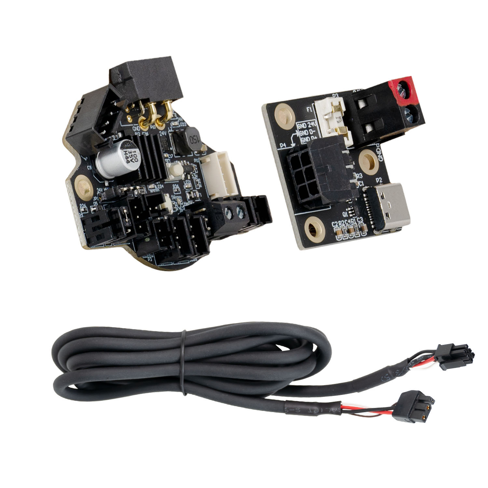

# Nitehawk-36

Nitehawk-36 is a toolboard featuring RP2040 MCU, TMC2209 stepper drive, ADXL345 accelerometer, and USB port. Nitehawk-36's USB based connection method allows for a simple and easy setup compared to other CAN toolboards. The USB connnection also allows for a secondary USB port to connect your nozzle webcam or eddy current probe.

# Features:
- Convenient wiring, no more complicated and error prone breakout cables
- USB Klipper connection, no additional software or hardware setup compared to CAN.
- Secondary USB port, an onboard USB port allows you to connect a second USB - device to your toolhead without running an additional umbilical cable.
- Custom toolhead cable, a single combined USB data and power cable rated for drag chain use, but can also be used in umbilical configuration.
- Convenient Input Shaping, run input shaper calibration at anytime with an onboard accelerometer.
- Tacho enabled HEF, the hotend fan port is three pin tachometer compatible, allowing for additional diagnostics and safety.